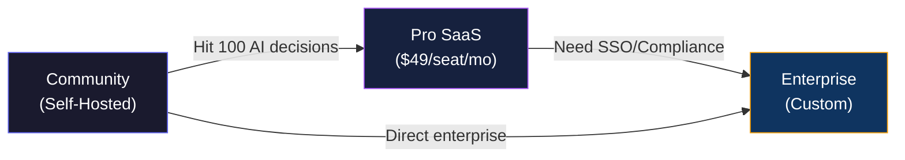
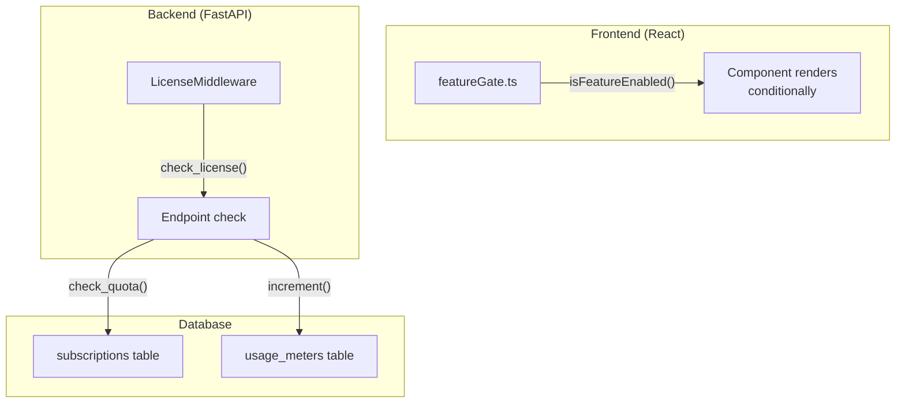
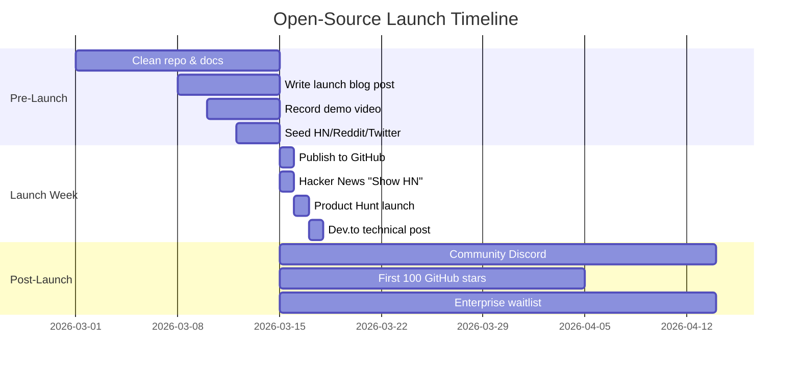

# Biz Stratosphere — Open-Core Strategy

> **Classification**: Investor-ready strategic document  
> **Version**: 1.0 · February 2026  
> **License**: Confidential — Internal/Board Use Only

---

## Part 1 — Open-Core Architecture Split

### 1.1 Community Edition (Apache 2.0)

The Community Edition is the **distribution engine** — it must be genuinely useful to build trust and adoption.

| Layer | Included in Community |
|-------|----------------------|
| **Frontend** | Dashboard, KPI cards, RevenueChart, DataUpload, AdvancedCharts, basic ExportButtons (CSV/JSON) |
| **Backend** | FastAPI gateway, REST endpoints, basic auth (email/password), standard CRUD |
| **ML** | Churn prediction (logistic regression), revenue forecasting (Prophet/ARIMA), basic anomaly detection |
| **Data** | PostgreSQL schema, CSV/XLSX upload, basic ETL pipeline |
| **Integrations** | Supabase Auth, single-workspace mode |
| **Decision Memory™** | Read-only viewer (5 entries), manual logging only |

### 1.2 Enterprise Edition (Proprietary)

Enterprise features create a **defensible moat** — they require infrastructure, scale, or compliance that self-hosted users can't easily replicate.

| Layer | Enterprise Only |
|-------|----------------|
| **Security** | SAML/OIDC SSO, Scoped API Keys (SHA-256), RBAC (6 roles), audit logging, `pgsodium` column encryption |
| **Decision Memory™** | Full engine — unlimited entries, RL feedback loop, outcome tracking, automated model retraining signals |
| **Prescriptive Engine** | Monte Carlo what-if simulations, automated rule engine ("If churn > 80%, auto-assign VIP support") |
| **ML Advanced** | SHAP waterfall explanations, model drift detection (Airflow DAGs), MLflow model registry, A/B serving |
| **Infrastructure** | Multi-workspace, Kubernetes Helm charts, Prometheus/Grafana/Loki observability stack |
| **Compliance** | SOC2 audit trail, GDPR data export/deletion, data lineage tracing |
| **Integrations** | Stripe billing, Salesforce/HubSpot connectors, Webhook automation |
| **Support** | Dedicated SAM, SLA guarantees, priority Slack channel |

### 1.3 Repository Structure — Split-Repo with Shared Core

```
github.com/biz-stratosphere/
├── biz-stratosphere/           ← Apache 2.0 (PUBLIC)
│   ├── src/                    # React frontend (community features)
│   ├── ml-service/             # ML service (basic models)
│   ├── supabase/               # DB schema, Edge Functions
│   ├── docs/                   # Docs, blog, API reference
│   ├── LICENSE                 # Apache 2.0
│   └── NOTICE                  # Trademark notice
│
├── biz-stratosphere-ee/        ← Commercial License (PRIVATE)
│   ├── src/enterprise/         # SSO, RBAC, audit, prescriptive engine
│   ├── ml-service/enterprise/  # SHAP, drift detection, MLflow
│   ├── infra/                  # K8s Helm charts, Terraform
│   ├── LICENSE                 # Commercial EULA
│   └── package.json            # Depends on biz-stratosphere as npm package
│
└── .github/                    ← Shared CI/CD workflows
```

> [!IMPORTANT]
> The `-ee` repo imports the community repo as an **npm dependency** (frontend) and **Docker base image** (backend). Enterprise code only adds — it never forks.

### 1.4 Technical Enforcement of Feature Gating

```typescript
// src/lib/featureGate.ts (Community repo — always present)
export type Edition = 'community' | 'pro' | 'enterprise';

export function getEdition(): Edition {
  return (import.meta.env.VITE_EDITION as Edition) || 'community';
}

export function isFeatureEnabled(feature: string): boolean {
  const edition = getEdition();
  const ENTERPRISE_FEATURES = [
    'sso', 'scoped_api_keys', 'rbac_advanced', 'prescriptive_engine',
    'shap_explanations', 'drift_detection', 'multi_workspace',
    'audit_logs', 'data_lineage', 'monte_carlo',
  ];
  const PRO_FEATURES = [
    'decision_memory_full', 'pdf_export_branded', 'csv_bulk_import',
    'email_support',
  ];

  if (ENTERPRISE_FEATURES.includes(feature)) return edition === 'enterprise';
  if (PRO_FEATURES.includes(feature)) return edition !== 'community';
  return true; // Community features always on
}
```

```typescript
// Usage in components:
import { isFeatureEnabled } from '@/lib/featureGate';

function MLInsights() {
  return (
    <Tabs>
      <Tab value="predict">Predictions</Tab>
      {isFeatureEnabled('shap_explanations') && (
        <Tab value="explain">Explain</Tab>
      )}
    </Tabs>
  );
}
```

### 1.5 IP Leakage Prevention

| Risk | Mitigation |
|------|-----------|
| Enterprise code in community PRs | CI check: reject PRs referencing `@enterprise/` imports |
| Contributors copying enterprise patterns | CLA assigns IP to Biz Stratosphere Inc. |
| Reverse-engineering feature flags | Flags control UI visibility only; enterprise *logic* lives in `-ee` repo |
| Competitors forking community | Apache 2.0 allows this — our moat is Decision Memory™ data network effects, not code |

---

## Part 2 — Licensing Strategy

### 2.1 Community: Apache 2.0

```
Copyright 2026 Biz Stratosphere, Inc.

Licensed under the Apache License, Version 2.0 (the "License");
you may not use this file except in compliance with the License.
You may obtain a copy of the License at

    http://www.apache.org/licenses/LICENSE-2.0
```

**Why Apache 2.0 (not MIT or AGPL)**:

- **Patent grant** protects contributors and users from patent trolls
- **Trademark clause** lets us protect "Biz Stratosphere" and "Decision Memory™"
- **Permissive** enough for enterprise adoption (unlike AGPL which scares legal teams)
- Industry precedent: Kubernetes (Apache 2.0), TensorFlow (Apache 2.0)

### 2.2 Enterprise: Commercial EULA Outline

```
BIZ STRATOSPHERE ENTERPRISE LICENSE AGREEMENT

1. GRANT — Licensee receives a non-exclusive, non-transferable license
   to use the Enterprise Edition for internal business purposes.

2. RESTRICTIONS
   a. May not sublicense, redistribute, or create derivative works.
   b. May not remove license key validation mechanisms.
   c. May not use Enterprise features in a competing product.

3. SEAT LIMITS — License is limited to purchased seat count.

4. TERM — Annual subscription; auto-renews unless cancelled 30 days prior.

5. IP OWNERSHIP — All Enterprise code, algorithms, and trade secrets
   remain the exclusive property of Biz Stratosphere, Inc.

6. DATA — Customer data remains Customer's property. Biz Stratosphere
   processes data solely to deliver the Service.

7. SLA — Enterprise tier: 99.9% uptime guarantee.

8. TERMINATION — Upon termination, Licensee must delete all Enterprise code
   and certify destruction in writing.
```

### 2.3 Trademark Protection

| Asset | Protection |
|-------|-----------|
| **"Biz Stratosphere"** | Registered trademark (file with USPTO) |
| **"Decision Memory™"** | Common-law trademark (™); file federal registration |
| **Logo** | Copyright + trademark registration |
| **"Biz Stratosphere Community Edition"** | Allowed for unmodified distributions |
| **"Powered by Biz Stratosphere"** | Required for derivative works per NOTICE file |

### 2.4 README Legal Notice

```markdown
## License

Biz Stratosphere Community Edition is licensed under the 
[Apache License 2.0](./LICENSE).

**"Biz Stratosphere"** and **"Decision Memory"** are trademarks of 
Biz Stratosphere, Inc. You may not use these marks in derivative 
products without written permission.

The Enterprise Edition is available under a separate 
[commercial license](https://bizstratosphere.com/enterprise).
```

### 2.5 Contributor License Agreement (CLA)

**Strategy**: Use a **CLA-bot** (e.g., `cla-assistant`) on the public repo.

```
INDIVIDUAL CONTRIBUTOR LICENSE AGREEMENT

By submitting a contribution, you agree:

1. You grant Biz Stratosphere, Inc. a perpetual, irrevocable,
   worldwide license to use, modify, and distribute your contribution
   under any license, including proprietary licenses.

2. You represent that you have the right to grant this license.

3. You understand that your contribution may be incorporated into
   both the Community and Enterprise editions.
```

> [!TIP]
> This CLA allows the company to dual-license community contributions into the enterprise edition — essential for open-core monetization.

---

## Part 3 — Monetization Model

### 3.1 Tier Structure

| | **Community** | **Pro (SaaS)** | **Enterprise** |
|---|---|---|---|
| **Price** | Free (self-hosted) | $49 /seat /month | Custom (starts $499/mo) |
| **Deployment** | Self-hosted only | Hosted SaaS | Hosted or on-prem |
| **Seats** | Unlimited | Up to 10 | Unlimited |
| **AI Decisions** | 100 /mo | 10,000 /mo | Unlimited |
| **Decision Memory™** | 5 entries (read-only) | Full (1-year retention) | Full (unlimited retention) |
| **ML Models** | Basic (LR, Prophet) | + Gradient Boosting, Neural | + Custom model import |
| **Explainability** | ❌ | ✅ SHAP waterfall | ✅ + LIME + counterfactuals |
| **Prescriptive Engine** | ❌ | ❌ | ✅ Monte Carlo + Rules |
| **SSO** | ❌ | Google OAuth | ✅ SAML/OIDC |
| **RBAC** | Admin / User | + Analyst / Viewer | + Auditor / Custom roles |
| **Audit Logs** | ❌ | Basic (30 days) | Full (immutable, SOC2) |
| **Data Lineage** | ❌ | ❌ | ✅ |
| **Support** | Community / GitHub | Email (24h SLA) | Dedicated SAM + Slack |
| **SLA** | None | 99.5% | 99.9% |
| **Observability** | ❌ | Basic health checks | Prometheus + Grafana + Loki |

### 3.2 Pricing Hypothesis

| Metric | Target |
|--------|--------|
| **Community → Pro conversion** | 5-8% of active users within 90 days |
| **Pro ARPU** | $245 /mo (avg 5 seats) |
| **Enterprise ACV** | $12,000–$60,000 /yr |
| **Payback period** | < 6 months |
| **LTV:CAC ratio** | > 3:1 |

### 3.3 Upgrade Path



**Upgrade triggers** (embedded in UI):

| Trigger | Message | CTA |
|---------|---------|-----|
| AI decision quota at 80% | "You've used 80 of 100 AI decisions" | "Upgrade to Pro" |
| SHAP tab click (Community) | "Understand why models predict" | "Unlock Explainability" |
| SSO settings page | "Connect your identity provider" | "Enterprise Only" |
| 2nd workspace creation | "Multi-workspace requires Pro" | "Upgrade" |

---

## Part 4 — Technical Enforcement Strategy

### 4.1 Feature Flags Architecture



**Three layers of enforcement:**

1. **UI Layer** — `featureGate.ts` hides/disables enterprise components
2. **API Layer** — `LicenseMiddleware` checks plan tier before processing requests
3. **DB Layer** — `check_quota()` PL/pgSQL function enforces usage limits

### 4.2 License Key Validation

```python
# ml-service/app/middleware/license.py
import hashlib, hmac, json, time
from base64 import b64decode

SIGNING_KEY = os.environ["LICENSE_SIGNING_KEY"]

def validate_license(license_key: str) -> dict:
    """
    License key format: base64({header}.{payload}.{signature})
    
    Payload: {
      "workspace_id": "uuid",
      "tier": "enterprise",
      "seats": 50,
      "features": ["sso", "prescriptive_engine", ...],
      "expires_at": 1740000000
    }
    """
    parts = b64decode(license_key).decode().split(".")
    header, payload, signature = parts[0], parts[1], parts[2]
    
    # Verify HMAC-SHA256 signature
    expected = hmac.new(
        SIGNING_KEY.encode(), 
        f"{header}.{payload}".encode(), 
        hashlib.sha256
    ).hexdigest()
    
    if not hmac.compare_digest(signature, expected):
        raise InvalidLicenseError("Signature mismatch")
    
    data = json.loads(payload)
    
    # Check expiration
    if data["expires_at"] < time.time():
        raise InvalidLicenseError("License expired")
    
    return data
```

**Enforcement flow:**

```
Request → LicenseMiddleware → validate_license()
    ├── Community: no key required, features = COMMUNITY_SET
    ├── Pro: key validated, features = PRO_SET 
    └── Enterprise: key validated, features = ENTERPRISE_SET
```

### 4.3 SaaS-Only Module Isolation

| Module | Repository | Deployment |
|--------|-----------|------------|
| `src/components/enterprise/` | `-ee` repo only | SaaS and on-prem enterprise |
| `ml-service/enterprise/` | `-ee` repo only | SaaS and on-prem enterprise |
| `infra/helm/` | `-ee` repo only | On-prem enterprise only |
| Billing (Stripe webhooks) | `-ee` repo only | SaaS only |

**Docker build strategy:**

```dockerfile
# Community Dockerfile
FROM node:20-alpine AS community
COPY . .
RUN npm run build

# Enterprise Dockerfile (in -ee repo)
FROM biz-stratosphere-community:latest AS enterprise
COPY enterprise/ ./src/enterprise/
ENV VITE_EDITION=enterprise
RUN npm run build
```

### 4.4 Hosted vs Self-Hosted

| Aspect | Self-Hosted (Community) | Hosted SaaS (Pro/Enterprise) |
|--------|------------------------|------------------------------|
| **Deployment** | `docker compose up` | `bizstratosphere.com` |
| **Updates** | Manual pull | Automatic (zero-downtime) |
| **Data** | Customer's infrastructure | Multi-tenant PostgreSQL |
| **ML Inference** | Local CPU | GPU cluster (shared) |
| **Backups** | Customer manages | Automated daily + PITR |
| **License check** | Offline key file | Online API call |

### 4.5 API Gating

```python
# FastAPI dependency injection pattern
from fastapi import Depends, HTTPException

async def require_feature(feature: str):
    """Dependency that checks if the current workspace has access to a feature."""
    async def checker(workspace_id: str = Depends(get_workspace)):
        plan = await get_plan(workspace_id)
        if not plan.has_feature(feature):
            raise HTTPException(
                status_code=403,
                detail={
                    "error": "feature_not_available",
                    "feature": feature,
                    "required_plan": get_minimum_plan(feature),
                    "upgrade_url": "https://bizstratosphere.com/upgrade"
                }
            )
    return Depends(checker)

# Usage:
@router.post("/prescriptive/simulate")
async def run_simulation(
    body: SimulationRequest,
    _gate = require_feature("prescriptive_engine")
):
    # Only enterprise users reach this code
    return await prescriptive_engine.simulate(body)
```

---

## Part 5 — Go-To-Market Strategy

### 5.1 Launch Strategy



### 5.2 Community Building Plan

| Channel | Action | Metric |
|---------|--------|--------|
| **GitHub** | Good first issues, CONTRIBUTING.md, PR templates | 50+ contributors in 6 months |
| **Discord** | #general, #help, #feature-requests, #enterprise | 500+ members in 3 months |
| **Dev.to / Hashnode** | Weekly technical blog posts | 10k reads/month |
| **Twitter/X** | Daily dev updates, feature previews | 2k followers in 3 months |
| **YouTube** | Tutorial series: "Build a BI Dashboard" | 5k subs in 6 months |
| **Conferences** | DataEngBytes, PyCon, React Summit talks | 2 talks in 6 months |

**Developer Evangelism Flywheel:**

```
Open Source → Stars → Blog Posts → Conference Talks
       ↓                                    ↓
   Contributors                      Enterprise Leads
       ↓                                    ↓
   Adoption → Feature Requests → Enterprise Revenue
```

### 5.3 Investor Positioning Narrative

> **One-liner**: Biz Stratosphere is the open-source Decision Intelligence platform — the "Datadog for business decisions."

**The pitch in 60 seconds:**

Every enterprise uses BI tools that *show* what happened and *predict* what will happen. None of them *remember what you did about it*. Decision Memory™ creates an institutional memory of every AI prediction, every human action, and every real-world outcome. This closed-loop dataset is a **proprietary moat** — the more decisions a company logs, the smarter the AI gets, and the harder it is to switch.

**Comparable exits:**

| Company | Model | Last Valuation |
|---------|-------|---------------|
| **Grafana Labs** | Open-core observability | $6B (Series D) |
| **GitLab** | Open-core DevOps | $8.6B (IPO) |
| **Databricks** | Open-source Spark → Enterprise | $43B |
| **Supabase** | Open-core BaaS | $2B (Series D) |

**Our wedge:** We're the only platform where the AI *improves from being wrong*. Every rejected prediction is a training signal.

### 5.4 Competitive Differentiation

| Competitor | What They Do | What We Do Different |
|-----------|-------------|---------------------|
| **Metabase** | Open-source SQL dashboards | We add ML predictions + Decision Memory™ |
| **Tableau/Looker** | Closed-source, expensive BI | We're open-core, 10x cheaper, AI-native |
| **Datadog** | Infrastructure observability | We observe *business decisions*, not servers |
| **Obviously AI** | No-code ML predictions | We close the loop: prediction → action → outcome |
| **Hex** | Notebook-based analytics | We're production-ready, not exploratory |

**Defensibility stack:**

1. **Data moat** — Decision Memory™ dataset grows with usage
2. **Network effects** — More decisions → better models → more users
3. **Switching cost** — Institutional decision history can't be migrated
4. **Open-source distribution** — Zero-CAC acquisition for community tier

### 5.5 12-Month Roadmap

| Quarter | Community Edition | Enterprise Edition | Business |
|---------|------------------|-------------------|----------|
| **Q1 2026** | GitHub launch, basic dashboard + ML, Decision Memory viewer | Private beta: SSO, RBAC, full Decision Memory™ | Seed raise ($1-2M), 3 design partners |
| **Q2 2026** | Plugin system, community connectors, improved docs | SHAP explainability, audit logs, Prescriptive Engine v1 | First 3 paying enterprise customers |
| **Q3 2026** | Mobile-responsive, embedding SDK, public API v2 | Multi-workspace, drift detection, Salesforce connector | Series A prep, 10+ enterprise customers |
| **Q4 2026** | Marketplace for community plugins | RL feedback loop, custom model import, SOC2 cert | Series A close ($5-10M), 25+ customers |

**Key milestones:**

| Date | Milestone |
|------|----------|
| Mar 2026 | GitHub public launch |
| Apr 2026 | 500 GitHub stars |
| Jun 2026 | First enterprise contract signed |
| Sep 2026 | 2,000 GitHub stars, 50 contributors |
| Dec 2026 | $500K ARR, Series A |

---

## Appendix: Feature Differentiation Matrix

```
Feature                        Community   Pro SaaS   Enterprise
─────────────────────────────────────────────────────────────────
Dashboard & KPI cards          ✅          ✅          ✅
CSV/XLSX data upload           ✅          ✅          ✅
Basic charts (line/bar/area)   ✅          ✅          ✅
Churn prediction (LR)          ✅          ✅          ✅
Revenue forecast (Prophet)     ✅          ✅          ✅
PDF export (basic)             ✅          ✅          ✅
Single workspace               ✅          ✅          ✅
─────────────────────────────────────────────────────────────────
Decision Memory™ (full)        ❌          ✅          ✅
Gradient Boosting models       ❌          ✅          ✅
SHAP waterfall explanations    ❌          ✅          ✅
Branded PDF exports            ❌          ✅          ✅
Google OAuth SSO               ❌          ✅          ✅
Email support (24h SLA)        ❌          ✅          ✅
─────────────────────────────────────────────────────────────────
Prescriptive Engine            ❌          ❌          ✅
Monte Carlo simulations        ❌          ❌          ✅
SAML/OIDC SSO                  ❌          ❌          ✅
Advanced RBAC (6 roles)        ❌          ❌          ✅
Immutable audit logs           ❌          ❌          ✅
Data lineage                   ❌          ❌          ✅
Model drift detection          ❌          ❌          ✅
Custom model import            ❌          ❌          ✅
Multi-workspace                ❌          ❌          ✅
Kubernetes Helm charts         ❌          ❌          ✅
Prometheus/Grafana stack       ❌          ❌          ✅
Dedicated SAM + SLA            ❌          ❌          ✅
SOC2 compliance package        ❌          ❌          ✅
─────────────────────────────────────────────────────────────────
```
