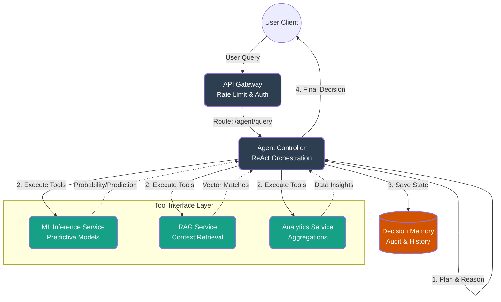

# Biz Stratosphere: 10-Second Agent Architecture

```mermaid
graph TD
    Client((User Client))
    API[API Gateway\nRate Limit & Auth]
    Agent[Agent Controller\nReAct Orchestration]
    Mem[(Decision Memory\nAudit & History)]
    
    subgraph Tool Interface Layer
        ML[ML Inference Service\nPredictive Models]
        RAG[RAG Service\nContext Retrieval]
        ANA[Analytics Service\nAggregations]
    end

    Client -->|User Query| API
    API -->|Route: /agent/query| Agent
    
    Agent -->|1. Plan & Reason| Agent
    Agent -->|2. Execute Tools| ML
    Agent -->|2. Execute Tools| RAG
    Agent -->|2. Execute Tools| ANA
    
    ML -.->|Probability/Prediction| Agent
    RAG -.->|Vector Matches| Agent
    ANA -.->|Data Insights| Agent
    
    Agent -->|3. Save State| Mem
    Agent -->|4. Final Decision| Client
    
    classDef main fill:#2C3E50,stroke:#none,color:#fff,stroke-width:2px,rx:10px,ry:10px
    classDef tool fill:#16A085,stroke:#none,color:#fff,stroke-width:2px,rx:10px,ry:10px
    classDef db fill:#D35400,stroke:#none,color:#fff,stroke-width:2px,rx:10px,ry:10px
    
    class API,Agent main
    class ML,RAG,ANA tool
    class Mem db
```
