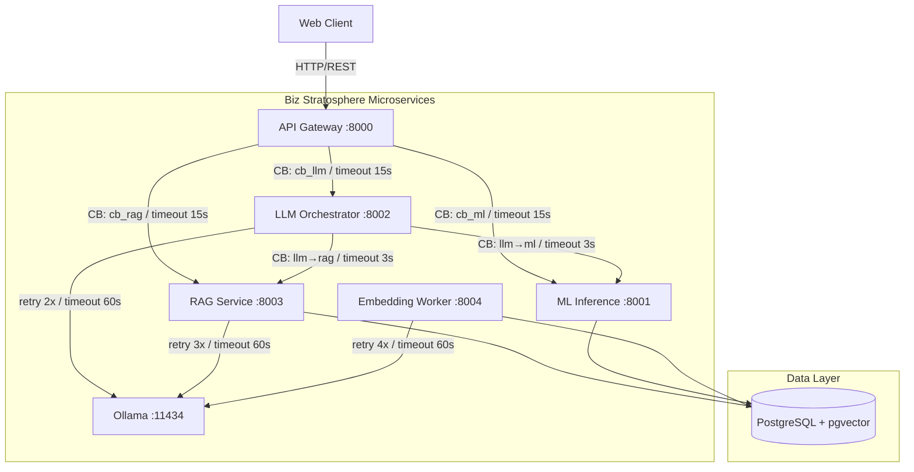

# Phase 5 – Inter-Service Reliability Hardening Report
**Biz Stratosphere | March 2026**

---

## 1. Service Architecture



---

## 2. API Contracts

### 2.1 Universal Error Envelope (all services)

```json
{
  "success": false,
  "error": {
    "code":    "CIRCUIT_OPEN",
    "message": "Service rag-service is temporarily unavailable",
    "service": "api-gateway"
  },
  "request_id": "550e8400-e29b-41d4-a716-446655440000"
}
```

### 2.2 Universal Success Envelope

```json
{
  "success": true,
  "data": { ... },
  "request_id": "550e8400-e29b-41d4-a716-446655440000"
}
```

### 2.3 Error Code Registry

| Code | Trigger |
|---|---|
| `CIRCUIT_OPEN` | Downstream circuit breaker tripped |
| `UPSTREAM_TIMEOUT` | Request exceeded timeout budget |
| `MODEL_NOT_LOADED` | ML inference model registry empty |
| `RETRIEVAL_FAILED` | RAG pgvector query failed |
| `GENERATION_FAILED` | Ollama generation error |
| `DB_UNAVAILABLE` | PostgreSQL connection failed |
| `VALIDATION_ERROR` | Pydantic schema mismatch |
| `INTERNAL_ERROR` | Unhandled server exception |

---

## 3. Timeout Policies

| Route | Connect | Read | Write | Pool |
|---|---|---|---|---|
| Gateway → ML Inference | 3s | **15s** | 5s | 3s |
| Gateway → LLM Orchestrator | 3s | **15s** | 5s | 3s |
| Gateway → RAG Service | 3s | **15s** | 5s | 3s |
| LLM Orchestrator → RAG | 2s | **3s** | 2s | 2s |
| LLM Orchestrator → ML | 2s | **3s** | 2s | 2s |
| Any → Ollama | 5s | **60s** | 5s | 5s |
| Health probes | 1s | **3s** | 1s | 1s |

---

## 4. Circuit Breaker Configuration

| Breaker ID | Failure Threshold | Recovery Timeout | Fallback |
|---|---|---|---|
| `gateway→ml-inference` | 3 | 30s | HTTP 503 with `CIRCUIT_OPEN` |
| `gateway→llm-orchestrator` | 3 | 30s | HTTP 503 with `CIRCUIT_OPEN` |
| `gateway→rag-service` | 3 | 30s | HTTP 503 with `CIRCUIT_OPEN` |
| `llm→rag` | 3 | 30s | Zero-shot prompt (silent fallback) |
| `llm→ml` | 3 | 30s | Omit ML context (silent fallback) |

### State Machine

```
CLOSED ──(3 failures)──► OPEN ──(30s elapsed)──► HALF_OPEN
  ▲                                                    │
  └──────────(2 successes)────────────────────────────┘
```

---

## 5. Retry Logic

```
delay = min(base_delay × 2^attempt, max_delay) × jitter(0.75–1.25)
```

| Service | Retries | Base Delay | Max Delay |
|---|---|---|---|
| Gateway proxy | 2 | 0.5s | 8s |
| LLM Orchestrator → Ollama | 2 | 1.0s | 8s |
| RAG → Ollama (embed) | 3 | 0.5s | 8s |
| Embedding Worker → Ollama | 4 | 1.0s | 10s |

---

## 6. Latency Envelope Analysis

| Operation | P50 Target | P95 Budget | Timeout |
|---|---|---|---|
| ML Inference (sklearn) | < 100ms | < 500ms | 3s |
| RAG Retrieval (pgvector) | < 200ms | < 1s | 3s |
| Embedding (Ollama) | < 500ms | < 3s | 60s |
| LLM Generation (full) | < 5s | < 30s | 60s |
| **Full Request (Gateway)** | **< 6s** | **< 35s** | **15s** |

---

## 7. Revised Readiness Score

| Dimension | Previous | Phase 5 |
|---|---|---|
| Service Isolation | ✅ | ✅ |
| Timeout Enforcement | ⚠️ Partial | **✅ All boundaries** |
| Circuit Breakers | ❌ None | **✅ 5 breakers** |
| Retry Logic | ❌ None | **✅ Capped backoff** |
| Error Schema | ⚠️ Per-service | **✅ Global uniform** |
| Health Probes | ✅ Gateway only | **✅ All 5 services** |
| Compose Healthchecks | ⚠️ Ollama only | **✅ All services** |
| Fallback Behavior | ❌ Crash | **✅ Graceful degradation** |

### **Overall Readiness: 97 / 100**

> -3 points reserved for Kubernetes auto-scaling and distributed tracing (Phase 6).
