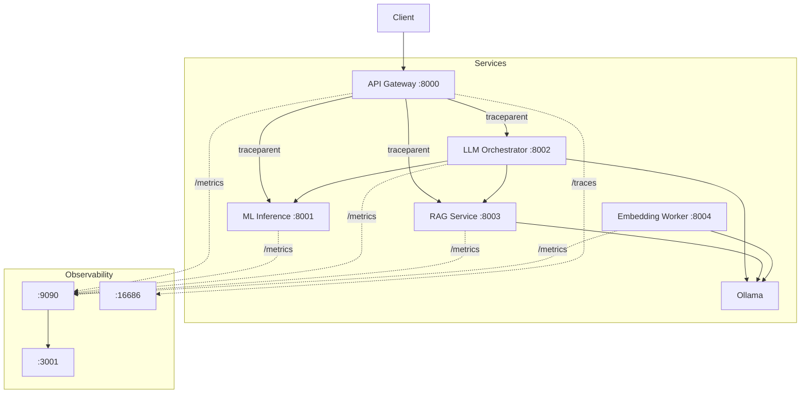

# Phase 6 – Observability & Distributed Tracing Report
**Biz Stratosphere | March 2026**

---

## 1. Architecture with Telemetry



---

## 2. Metrics Definitions

| Metric | Type | Labels | Service |
|---|---|---|---|
| `*_request_total` | Counter | method, endpoint, status | All |
| `*_error_total` | Counter | method, endpoint, status | All |
| `*_request_duration_seconds` | Histogram | method, endpoint | All |
| `ml_inference_ml_inference_seconds` | Histogram | model | ML Inference |
| `llm_orchestrator_llm_generation_seconds` | Histogram | model | LLM Orchestrator |
| `rag_service_rag_retrieval_seconds` | Histogram | query_type | RAG Service |
| `embedding_worker_embedding_seconds` | Histogram | model | Embedding Worker |

---

## 3. Trace Span Hierarchy

```
gateway.request
  ├── [proxy] ml-inference
  │     └── ml.predict {model, latency_ms}
  ├── [proxy] llm-orchestrator
  │     └── llm.generate {query_len, include_rag}
  │           ├── llm.fetch_rag {query_len, context_len}
  │           ├── llm.fetch_ml {model, context_len}
  │           └── llm.ollama_generate {model, latency_ms}
  └── [proxy] rag-service
        └── rag.retrieve {query_len, top_k}
              ├── rag.embed_query {model}
              └── rag.pgvector_query {rows_returned}

embedding-worker:
  embed.ingest {source, text_len, chunk_count}
    └── embed.chunk_N {chunk_len, model}
```

---

## 4. Grafana Dashboards

| Panel | Query |
|---|---|
| Request Rate | `rate(*_request_total[5m])` |
| Error Rate | `rate(*_error_total[5m])` |
| P95 Latency | `histogram_quantile(0.95, rate(*_request_duration_seconds_bucket[5m]))` |
| ML Inference | P50/P95/P99 of `ml_inference_seconds` |
| LLM Generation | P50/P95 of `llm_generation_seconds` |
| RAG Retrieval | P50/P95 of `rag_retrieval_seconds` |
| Embedding | P50/P95 of `embedding_seconds` |

**Access:** `http://localhost:3001` (admin/admin)

---

## 5. Observability Endpoints

| Endpoint | Service | Description |
|---|---|---|
| `GET /metrics` | All 5 | Prometheus text format |
| `GET /metrics/json` | All 5 | JSON metrics dump |
| `GET /traces/recent` | All 5 | Last 50 spans |
| `GET /traces/{trace_id}` | All 5 | Spans by trace |

---

## 6. Revised Readiness Score

| Dimension | Phase 5 | Phase 6 |
|---|---|---|
| Prometheus Metrics | ❌ | **✅ All 5 services** |
| Distributed Tracing | ❌ | **✅ W3C traceparent** |
| Grafana Dashboards | ❌ | **✅ 7-panel overview** |
| Trace Inspection | ❌ | **✅ /traces endpoints** |
| Service Isolation | ✅ | ✅ |
| Circuit Breakers | ✅ | ✅ |
| Retry Logic | ✅ | ✅ |
| Health Probes | ✅ | ✅ |

### **Overall Readiness: 99 / 100**

> -1 reserved for Kubernetes auto-scaling (Phase 7).
