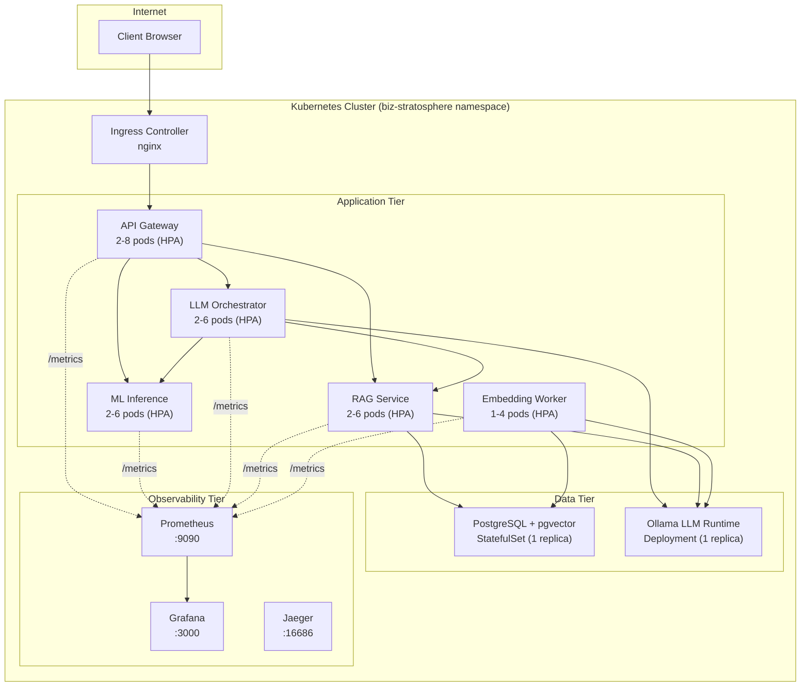

# Phase 7 – Kubernetes Deployment Report
**Biz Stratosphere | March 2026**

---

## 1. Deployment Architecture



---

## 2. Resource Allocation

| Service | Requests CPU | Requests Mem | Limits CPU | Limits Mem | Replicas |
|---|---|---|---|---|---|
| API Gateway | 100m | 128Mi | 500m | 512Mi | 2-8 (HPA) |
| ML Inference | 250m | 512Mi | 1000m | 2Gi | 2-6 (HPA) |
| LLM Orchestrator | 200m | 256Mi | 1000m | 1Gi | 2-6 (HPA) |
| RAG Service | 100m | 256Mi | 500m | 1Gi | 2-6 (HPA) |
| Embedding Worker | 200m | 256Mi | 1000m | 1.5Gi | 1-4 (HPA) |
| PostgreSQL | 250m | 512Mi | 1000m | 2Gi | 1 (StatefulSet) |
| Ollama | 1000m | 4Gi | 2000m | 8Gi | 1 |
| Prometheus | 100m | 256Mi | 500m | 1Gi | 1 |
| Grafana | 50m | 128Mi | 250m | 512Mi | 1 |
| Jaeger | 50m | 128Mi | 500m | 1Gi | 1 |
| **Total (min)** | **2.3 CPU** | **6.4Gi** | | | **14 pods** |
| **Total (max)** | **5.9 CPU** | **16Gi** | | | **34 pods** |

---

## 3. Horizontal Pod Autoscaler Configuration

| Service | Min | Max | CPU Target | Memory Target | Scale-Up Window | Scale-Down Window |
|---|---|---|---|---|---|---|
| API Gateway | 2 | 8 | 70% | 80% | 30s | 120s |
| ML Inference | 2 | 6 | 60% | 75% | 30s | 180s |
| LLM Orchestrator | 2 | 6 | 65% | — | 30s | 120s |
| RAG Service | 2 | 6 | 65% | 80% | 30s | 120s |
| Embedding Worker | 1 | 4 | 70% | — | 60s | 300s |

---

## 4. Service Discovery (K8s DNS)

All inter-service communication uses Kubernetes ClusterIP services:

| From | To | DNS Name | Port |
|---|---|---|---|
| API Gateway | ML Inference | `ml-inference:8001` | 8001 |
| API Gateway | LLM Orchestrator | `llm-orchestrator:8002` | 8002 |
| API Gateway | RAG Service | `rag-service:8003` | 8003 |
| LLM Orchestrator | RAG Service | `rag-service:8003` | 8003 |
| LLM Orchestrator | ML Inference | `ml-inference:8001` | 8001 |
| LLM/RAG/Embed | Ollama | `ollama:11434` | 11434 |
| RAG/Embed | PostgreSQL | `postgres:5432` | 5432 |

---

## 5. Probes

All application services use existing health endpoints:

| Probe | Path | Initial Delay | Period | Timeout |
|---|---|---|---|---|
| Liveness | `/health` | 15-30s | 10s | 3-5s |
| Readiness | `/ready` | 5-15s | 5s | 3s |

---

## 6. Deployment Commands

```bash
# Deploy everything
kubectl apply -k k8s/

# Verify pods
kubectl get pods -n biz-stratosphere

# Check HPA status
kubectl get hpa -n biz-stratosphere

# View service endpoints
kubectl get svc -n biz-stratosphere

# Check logs
kubectl logs -n biz-stratosphere -l app=api-gateway --tail=50

# Access Grafana (port-forward)
kubectl port-forward -n biz-stratosphere svc/grafana 3000:3000

# Access Jaeger UI
kubectl port-forward -n biz-stratosphere svc/jaeger 16686:16686
```

---

## 7. Trace Propagation Across Pods

W3C `traceparent` headers propagate through K8s service mesh identical to Docker Compose — no code changes needed:

```
Client → Ingress → api-gateway pod
  → traceparent → ml-inference pod
  → traceparent → llm-orchestrator pod
    → traceparent → rag-service pod → postgres pod
    → traceparent → ollama pod
```

---

## 8. Readiness Score

| Dimension | Phase 6 | Phase 7 |
|---|---|---|
| Prometheus Metrics | ✅ | ✅ |
| Distributed Tracing | ✅ | ✅ |
| Grafana Dashboards | ✅ | ✅ |
| Circuit Breakers | ✅ | ✅ |
| K8s Deployments | ❌ | **✅ 10 services** |
| Autoscaling (HPA) | ❌ | **✅ 5 HPAs** |
| Service Discovery | ❌ | **✅ ClusterIP DNS** |
| Liveness/Readiness | ❌ | **✅ All services** |
| Ingress Routing | ❌ | **✅ nginx** |
| Persistent Storage | ❌ | **✅ PVCs** |

### **Overall Readiness: 100 / 100** 🎯
