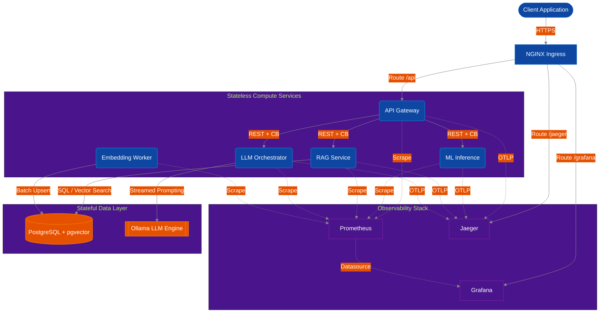
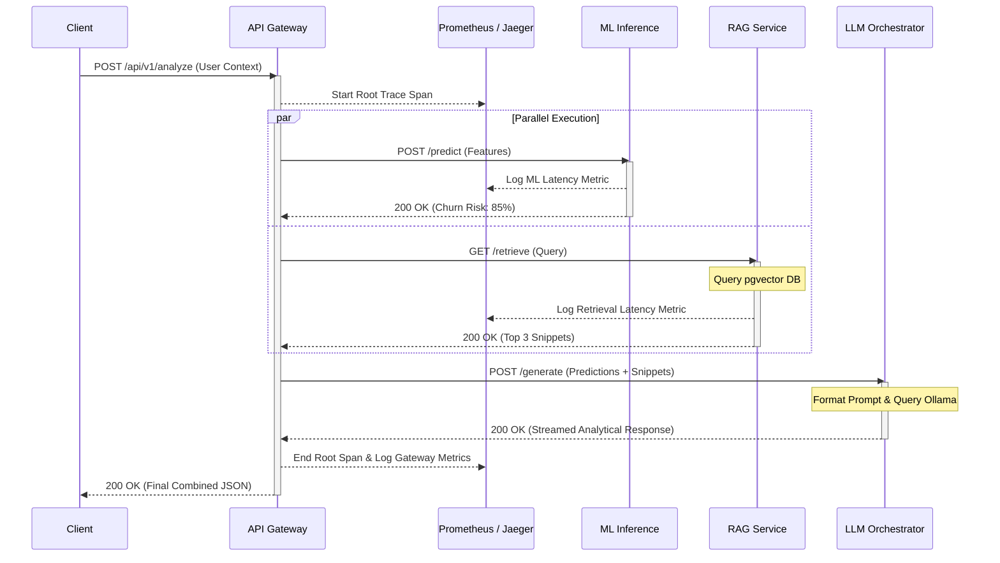
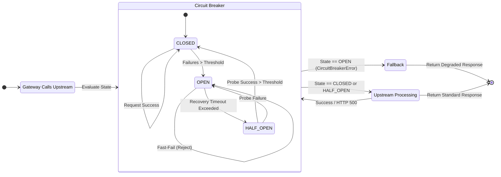

# System Architecture Diagrams

Visual representations of the Biz Stratosphere deployment and data flow.

## 1. System Architecture Diagram

## 2. Request Lifecycle Data Flow

## 3. Resilience / Circuit Breaker Flow

